Original App Design Project 
===

# LocoFoco

## Table of Contents
1. [Overview](#Overview)
1. [Product Spec](#Product-Spec)
1. [Wireframes](#Wireframes)
2. [Schema](#Schema)

## Overview
### Description
So if you’re wondering about the name of our app, Loco Foco. Loco means crazy in Spanish and by combining it with “Foco” which is our shortened version for “Focus”, the app name roughly translates to “Crazy Focus”. We thought it would be a fun name to go with our productivity app. Also fun fact our cat mascot is named “Loco”. The main function of Loco Foco is for the user to set up timers for their study/work periods. What sets Loco Foco apart from other timer apps is that users are motivated to finish their task by being able to collect THE MOST ADORABLE, HEART MELTING cat pictures. With timer functionality and an encaptivating collection of cat images, LocoFoco is the perfect balance of productivity and heartwarming engagement. 

### Build Progress (Updated as of 03/25/22)

 ## Basic DEMO
 

 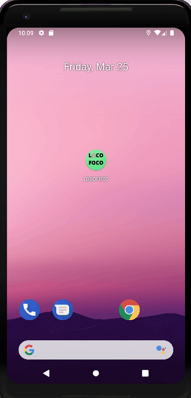
 

 ## Timer + Animation
 ### Setting Time
  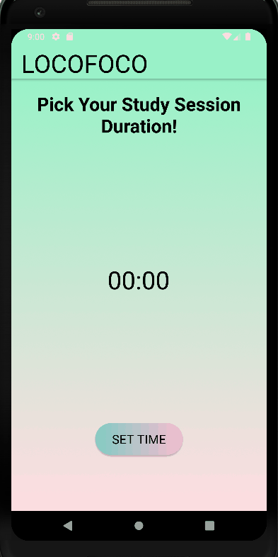
 
 ### Animation +  Loco in Sync With Your Work
   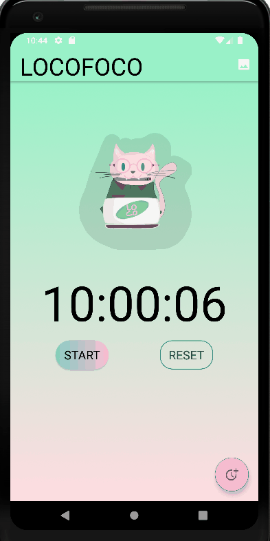

  
  
 ## Gallery  

### Recieving and Adding New Cat Images in Gallery
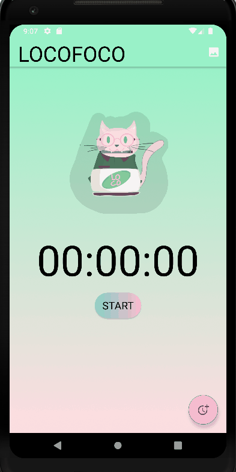

### Deleting An Image
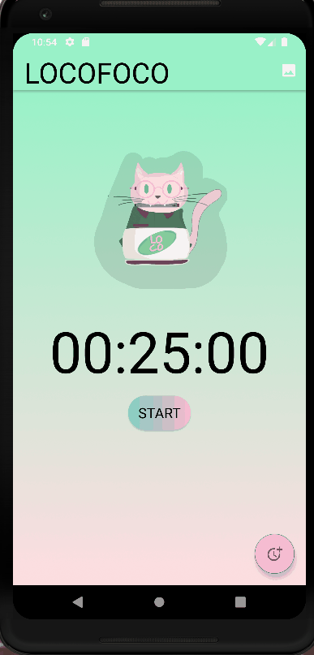

### Clearing Gallery

 

## Sharing Cat Pictures
### In Pop Up Window
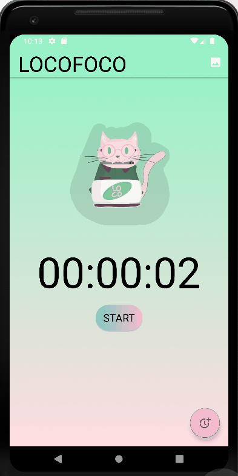

### In Gallery
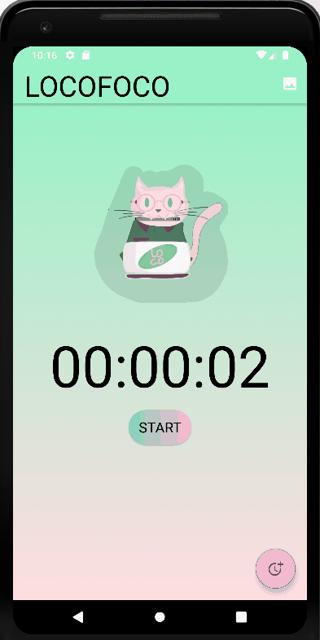

### App Evaluation
- **Category:** Productivity 
- **Mobile:** This is app can be used on Android mobile phones. 
- **Story:** Times the user study and break periods. Will also run a cat animation to motivate the user. 
- **Market:** Primarily, any individual who needs to accomplish a task within a period of time would be interested in using the timer app to help them pace their productivity. 
- **Habit:** As long as there's a task that needs to get done, this focus app can be used at any time of day the user feel is their productivity time. 
- **Scope:** At the start of this project, the present members, Xinyi and Stephany will complete the overview of the Focus App in the ReadMe File. From there, we will consult with the rest of team on further features and planning to integrate the groundworks of the app.

## Product Spec

### 1. User Stories (Required and Optional)

**Required Must-have Stories**
* [x] Users can start/reset/pause timer
* [x] Set/edit timer
* [x] Have Cat Images Show Up In Gallery
* [x] Progressive element: pop up a cat image at the end of a focus session (using a cat pic API)

**Optional Nice-to-have Stories**

* Study Music Playing in the Background (user's choice from their Spotify Playlist)
* Google calendar integration
* Users can view/edit the list of tasks

### 2. Screen Archetypes

* Home Screen
   * Timer
   * Settings to change timer
   * Cat animation
* Gallery Page
   * Showcase all the cat images that user has acquired
   

### 3. Navigation

**Tab Navigation** (Tab to Screen)

* Home Screen Button
* Gallery Button

**Flow Navigation** (Screen to Screen)

* Open the app -> Home Screen
   * Click on Gallery Button to go to Gallery Page
* Gallery Page 
   * Click on Home Screen to go back to Home Screen
  

## Wireframes
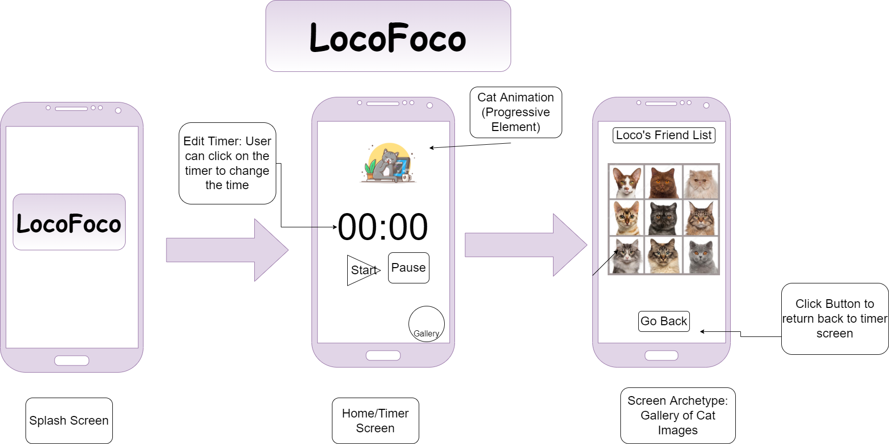

### Models
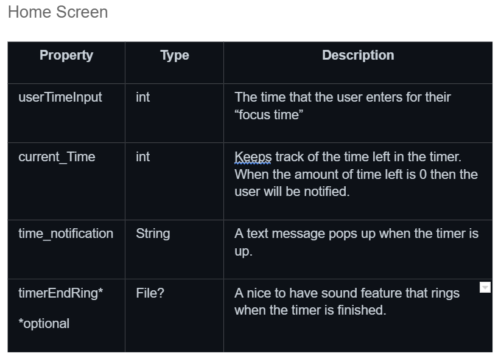
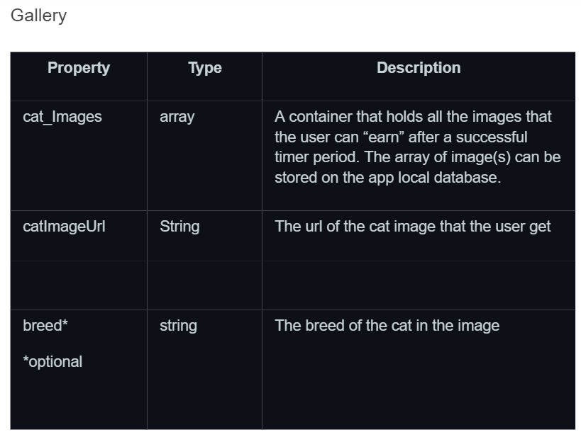

# Existing API Endpoints
Base url: https://api.thecatapi.com/v1

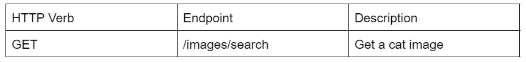

- TheCatApi: https://docs.thecatapi.com/

# Other Applications Used

'Loco' 2D Cat Animation: Blender Software 
App Logo: Canva

